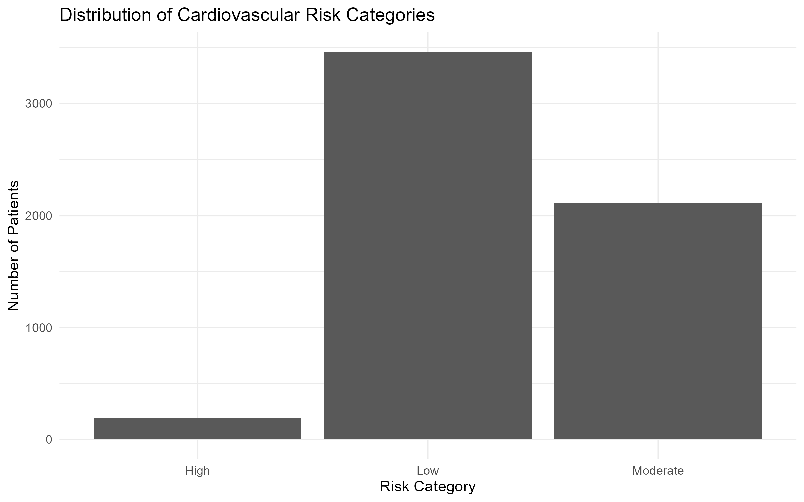
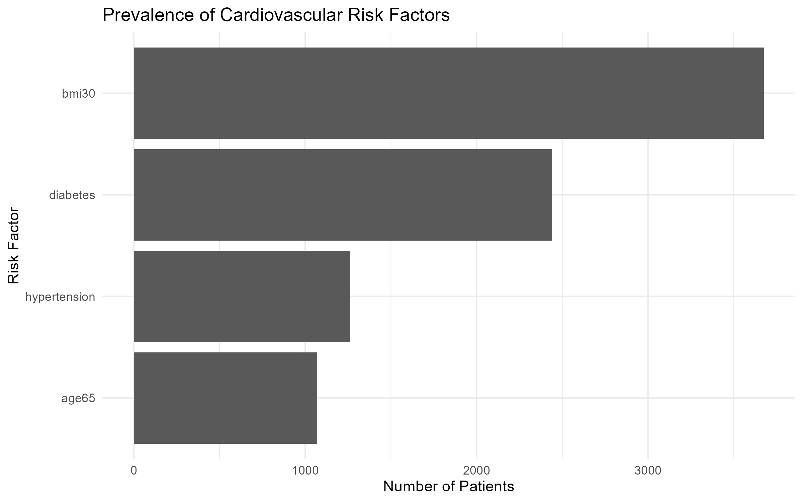
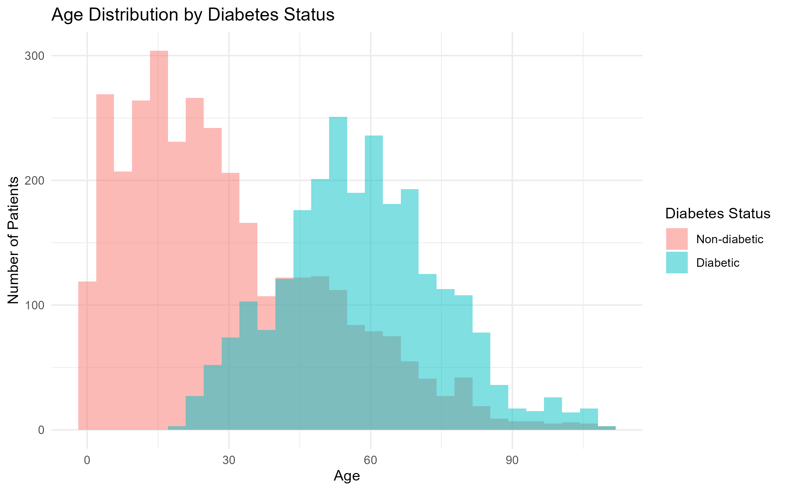
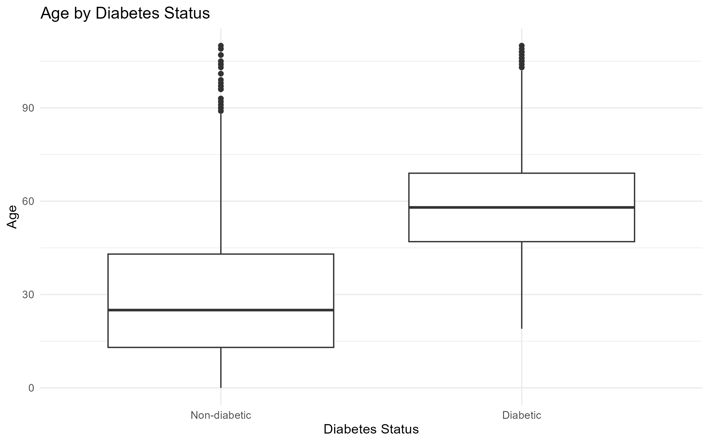
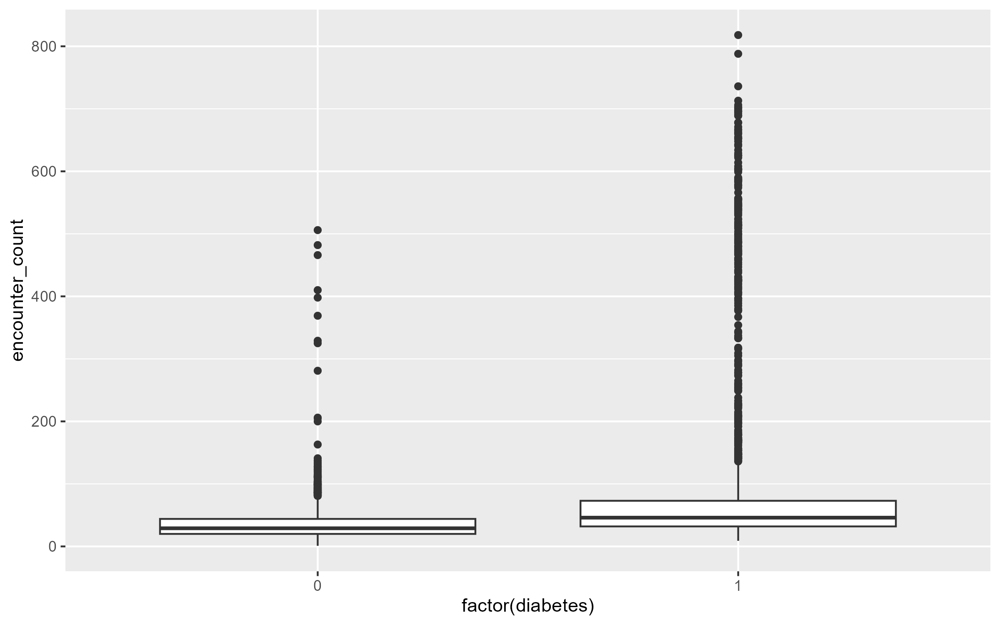
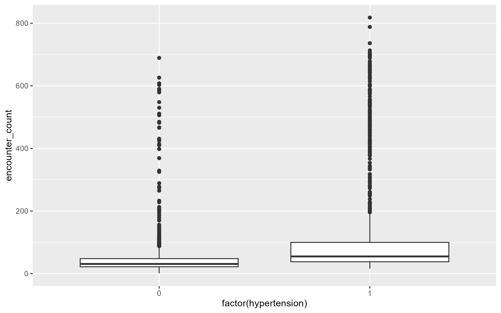
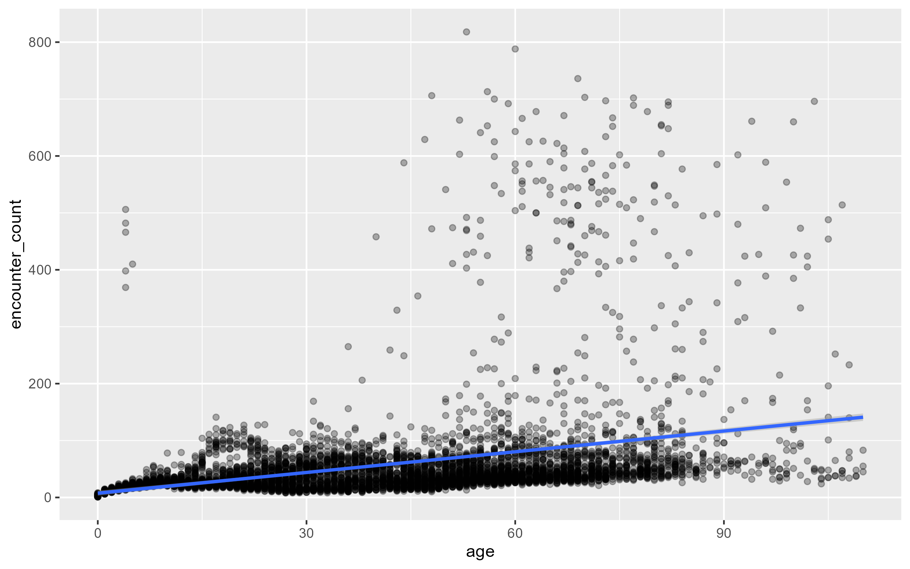
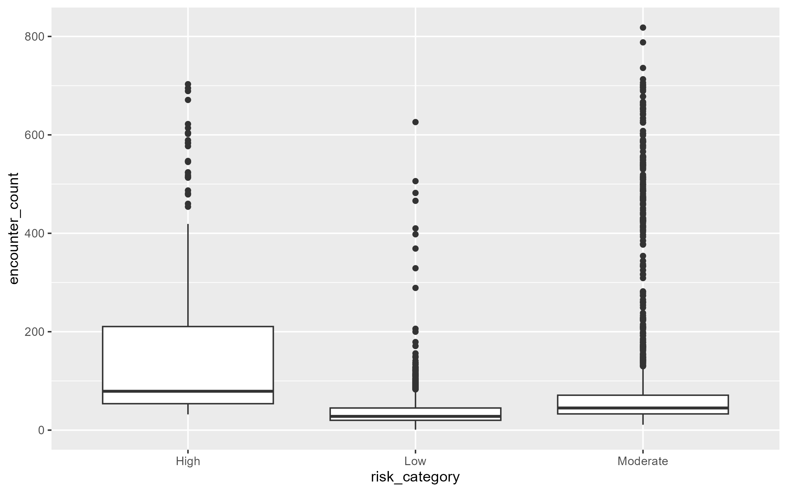
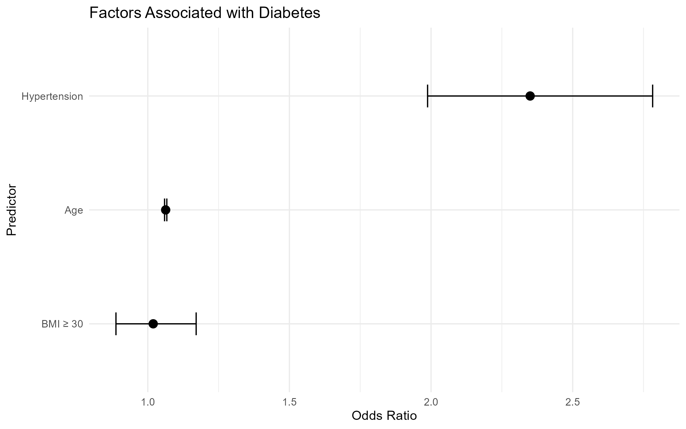

# Background

Healthcare organisations generate vast amounts of electronic health record (EHR) data through routine clinical care. These data contain valuable information on patient demographics, healthcare utilisation, diagnoses, medications and clinical observations, providing opportunities to better understand disease patterns and support evidence-based decision making.

However, extracting meaningful insights from healthcare data requires more than statistical analysis alone. Healthcare analytics relies on an end-to-end workflow involving data engineering, database management, feature engineering, statistical modelling and effective communication of results. Developing these skills is essential for data scientists working within healthcare, pharmaceutical research and clinical analytics.

The objective of this project is to demonstrate a complete healthcare analytics workflow using synthetic electronic health record data generated with Synthea. The project integrates PostgreSQL for relational database management, SQL for data extraction and feature engineering, R for statistical analysis and visualisation, Quarto for reproducible reporting and Python for machine learning. Rather than focusing on a single analytical technique, the project aims to illustrate how these technologies can be combined to answer clinically meaningful questions using structured healthcare data.

The analyses investigate several aspects of the synthetic patient population, including demographic characteristics, healthcare utilisation, disease epidemiology, medication utilisation and cardiovascular risk factors. Statistical methods are then used to examine relationships between patient characteristics and chronic disease, demonstrating how healthcare datasets can be transformed into actionable analytical insights.

Although the data used in this project are entirely synthetic and do not represent real patients, they preserve realistic relationships between clinical entities and provide a safe environment for developing reproducible healthcare analytics workflows without privacy concerns.

# Objectives

The objectives of this project are to:

- Build a relational healthcare database using PostgreSQL.
- Explore patient demographics and healthcare utilisation using SQL.
- Engineer patient-level clinical features for downstream analysis.
- Investigate relationships between patient characteristics and chronic disease using statistical methods in R.
- Produce reproducible analyses and publication-quality visualisations using Quarto.
- Demonstrate an end-to-end healthcare analytics workflow suitable for healthcare data science applications.

# Methods

## Dataset

This project utilised a synthetic electronic health record (EHR) dataset generated using Synthea, an open-source patient simulation software designed to produce realistic healthcare records while preserving patient privacy. The synthetic dataset includes patient demographics, healthcare encounters, diagnoses, medications, clinical observations and other healthcare-related information linked through relational identifiers.

Unlike publicly available datasets that often contain only a single aspect of patient care, the Synthea dataset simulates longitudinal healthcare records that resemble real-world clinical databases. This allows relationships between patient characteristics, diseases, medications and healthcare utilisation to be explored within a realistic analytical environment without the ethical and privacy considerations associated with real patient data.

For this project, a synthetic population of approximately 5,000 patients was generated and exported as comma-separated value (CSV) files for import into PostgreSQL.

## 3.2 Database Construction

The CSV files generated by Synthea were imported into PostgreSQL to create a relational healthcare database.

Five core tables were used throughout the analyses:

- **patients** – demographic information including age, sex, race and county.
- **encounters** – healthcare encounters including encounter class, provider and organisation.
- **conditions** – patient diagnoses recorded using SNOMED CT terminology.
- **medications** – prescribed medications and associated clinical indications.
- **observations** – clinical measurements such as body mass index (BMI), blood pressure and laboratory observations.

Primary and foreign keys were used to preserve relationships between tables, allowing patient records to be linked across multiple healthcare domains.

## SQL Feature Engineering

PostgreSQL was used to prepare analysis-ready datasets prior to statistical analysis.

Structured Query Language (SQL) was used to:

- explore patient demographics and healthcare utilisation;
- investigate disease prevalence and medication utilisation;
- summarise clinical observations;
- construct reusable SQL views for downstream analyses.

Patient-level analytical datasets were generated using Common Table Expressions (CTEs), multi-table joins and conditional logic.

A cardiovascular risk profile was engineered by combining demographic information with selected clinical risk factors. Binary variables representing age ≥65 years, obesity (BMI ≥30 kg/m²), diabetes and hypertension were combined into a simple cardiovascular risk score, allowing patients to be categorised into low-, moderate- and high-risk groups for subsequent analyses.

## Statistical Analysis

Statistical analyses were performed using R.

Descriptive statistics were calculated to summarise patient characteristics and cardiovascular risk profiles.

Relationships between patient characteristics and disease status were investigated using non-parametric hypothesis testing and logistic regression.

The following statistical methods were applied throughout the project:

- Wilcoxon rank-sum tests for comparing continuous variables between two groups;
- Kruskal–Wallis tests for comparisons involving more than two groups;
- Logistic regression to investigate associations between patient characteristics and diabetes;
- Odds ratios with 95% confidence intervals to quantify model coefficients.

Exploratory visualisations were produced using the ggplot2 package to communicate patient demographics, disease prevalence and healthcare utilisation patterns.

## Software

The analytical workflow combined multiple technologies to demonstrate an end-to-end healthcare analytics pipeline.

- PostgreSQL was used for relational database management.
- SQL was used for data extraction, transformation and feature engineering.
- R was used for statistical analysis and data visualisation.
- Quarto was used to generate a fully reproducible analytical report.
- Git and GitHub were used for version control and project management.

## Analytical Workflow

The analytical workflow was designed to separate data preparation, statistical analysis and reporting into distinct stages.

1.  Synthetic EHR data were generated using Synthea.
2.  CSV files were imported into PostgreSQL.
3.  SQL was used to clean, transform and engineer patient-level analytical datasets.
4.  R was used to perform statistical analyses and generate publication-quality visualisations.
5.  Quarto integrated the analytical outputs into a reproducible report.

# Results

## Patient Cardiovascular Risk Profile

A total of **5,764 patients** were included in the cardiovascular risk analysis following the construction of the patient-level risk profile within PostgreSQL.

The engineered cardiovascular risk score incorporated four binary risk factors:

- Age ≥65 years
- Body mass index (BMI) ≥30 kg/m²
- Diabetes
- Hypertension

Patients were subsequently categorised into **low-, moderate- and high-risk groups** according to their cumulative risk score.

### Cardiovascular Risk Categories

Most patients were classified as **low cardiovascular risk**, representing **60.1% (n = 3,462)** of the study population (Figure 1). A further **36.7% (n = 2,114)** were classified as moderate risk, while only **3.3% (n = 188)** met the criteria for the high-risk category.

These findings suggest that although individual cardiovascular risk factors were common within the synthetic population, relatively few patients simultaneously exhibited all major risk factors included within the composite risk score.

*Figure 1. Distribution of cardiovascular risk categories across the synthetic patient population.*

{fig-align="center"}

### Distribution of Cardiovascular Risk Scores

Risk scores ranged from **0 to 4**, with the majority of patients receiving relatively low scores.

| Risk Score | Patients |
|------------|---------:|
| 0          |      780 |
| 1          |    2,682 |
| 2          |    1,329 |
| 3          |      785 |
| 4          |      188 |

The most common risk score was **1**, indicating that most patients possessed a single cardiovascular risk factor. Only **188 patients (3.3%)** accumulated all four risk factors simultaneously.

This distribution demonstrates that the engineered risk score effectively stratified patients into clinically interpretable risk groups while maintaining variation suitable for subsequent statistical analyses.

### Prevalence of Cardiovascular Risk Factors

The prevalence of each cardiovascular risk factor was examined individually (Figure 2).

Obesity, defined as **BMI ≥30 kg/m²**, was the most frequently observed cardiovascular risk factor, affecting approximately **64%** of the synthetic population. Diabetes was present in approximately **42%** of patients, while hypertension and age ≥65 years were considerably less common.

The relatively high prevalence of obesity compared with hypertension and older age reflects the characteristics of the synthetic population generated for this project rather than estimates from real-world epidemiological studies.

*Figure 2. Prevalence of engineered cardiovascular risk factors.*

{fig-align="center"}

### Summary

The engineered cardiovascular risk profile provided a concise patient-level representation of multiple chronic disease risk factors by integrating demographic characteristics, clinical observations and diagnosis data across several relational database tables.

This derived analytical dataset formed the basis for subsequent statistical analyses investigating associations between age, chronic disease and healthcare utilisation.

## Association Between Age and Diabetes

To investigate whether age was associated with diabetes within the synthetic patient population, descriptive statistics, non-parametric hypothesis testing and logistic regression were performed.

### Descriptive Statistics

A total of **5,764 patients** were included in the analysis, comprising **3,324 non-diabetic** and **2,440 diabetic** patients.

Diabetic patients were substantially older than non-diabetic patients, with a **mean age of 58.2 years** (median 58 years) compared with **29.5 years** (median 25 years) among non-diabetic patients (Table 1).

| Diabetes Status | Patients | Mean Age | Median Age | Standard Deviation |
|-----------------|---------:|---------:|-----------:|-------------------:|
| Non-diabetic    |    3,324 |     29.5 |         25 |               21.5 |
| Diabetic        |    2,440 |     58.2 |         58 |               16.8 |

The age distributions are illustrated in Figures 3 and 4.

*Figure 3. Age distribution of diabetic and non-diabetic patients.*

{fig-align="center"}

*Figure 4. Distribution of age according to diabetes status.*

{fig-align="center"}

The histogram demonstrates a clear shift towards older ages among patients with diabetes, while the boxplot shows substantially higher median age and interquartile range compared with non-diabetic patients.

### Wilcoxon Rank-Sum Test

Because age was not assumed to follow a normal distribution, a Wilcoxon rank-sum test was performed to compare age between diabetic and non-diabetic patients.

The analysis demonstrated a statistically significant difference in age between the two groups (**W = 1,220,348, p \< 0.001**), indicating that diabetic patients were significantly older than non-diabetic patients.

### Logistic Regression

A univariable logistic regression model was fitted to evaluate the association between age and diabetes.

Age was identified as a statistically significant predictor of diabetes (**β = 0.068, p \< 0.001**).

To aid interpretation, model coefficients were converted to odds ratios.

The estimated odds ratio for age was **1.07 (95% CI: 1.07–1.07)**, indicating that each additional year of age was associated with approximately a **7% increase in the odds of diabetes** within the synthetic patient population (Figure 5).

### Summary

Both descriptive and inferential analyses consistently demonstrated a strong positive association between age and diabetes. Older patients exhibited significantly higher diabetes prevalence, and logistic regression confirmed age as a significant predictor of diabetes in the synthetic electronic health record dataset.

## Healthcare Utilisation

Healthcare utilisation was evaluated by examining the number of recorded healthcare encounters for each patient and comparing utilisation across disease status, age and cardiovascular risk groups.

### Diabetes and Healthcare Utilisation

Patients with diabetes demonstrated substantially greater healthcare utilisation than patients without diabetes.

The mean number of recorded encounters among diabetic patients was **87**, compared with **36** among non-diabetic patients. Median encounter counts were also higher in diabetic patients (46 versus 29 encounters), indicating consistently greater healthcare utilisation across the diabetic population.

| Diabetes Status | Mean Encounters | Median Encounters |
|-----------------|----------------:|------------------:|
| Non-diabetic    |              36 |                29 |
| Diabetic        |              87 |                46 |

A Wilcoxon rank-sum test demonstrated a statistically significant difference in encounter frequency between diabetic and non-diabetic patients (**p \< 0.001**).

*Figure 5. Healthcare encounters according to diabetes status.*

{fig-align="center"}

The distribution indicates that diabetic patients not only had higher median healthcare utilisation but also exhibited substantially greater variability in encounter frequency, suggesting that a subset of diabetic patients required frequent interaction with healthcare services.

### Hypertension and Healthcare Utilisation

Patients with hypertension also demonstrated increased healthcare utilisation.

The mean encounter count increased from **40** among patients without hypertension to **119** among patients with hypertension, while median encounters increased from **31** to **55**.

| Hypertension Status | Mean Encounters | Median Encounters |
|---------------------|----------------:|------------------:|
| No                  |              40 |                31 |
| Yes                 |             119 |                55 |

The Wilcoxon rank-sum test again identified a statistically significant difference in healthcare utilisation between the two groups (**p \< 0.001**).

*Figure 6. Healthcare encounters according to hypertension status.*

{fig-align="center"}

Compared with diabetes, hypertension showed an even larger difference in mean encounter frequency, indicating that hypertensive patients within the synthetic population generally required more frequent healthcare interactions.

### Age and Healthcare Utilisation

The relationship between age and healthcare utilisation was further investigated using correlation analysis.

A statistically significant positive correlation was observed between age and encounter count (**Pearson's r = 0.327, p \< 0.001**), indicating that healthcare utilisation increased with patient age.

Although statistically significant, the correlation coefficient suggests a **moderate** rather than strong relationship, indicating that additional clinical factors also contribute to healthcare utilisation.

*Figure 7. Relationship between patient age and healthcare encounters.*

{fig-align="center"}

The scatter plot illustrates a gradual increase in encounter frequency with age while also demonstrating substantial variability among older patients, reflecting the heterogeneous nature of healthcare utilisation.

### Cardiovascular Risk Category

Healthcare utilisation differed significantly across cardiovascular risk categories.

Patients classified as **High Risk** demonstrated the greatest median healthcare utilisation, whereas patients within the **Low Risk** category recorded the fewest encounters.

A Kruskal–Wallis test confirmed statistically significant differences between the three cardiovascular risk groups (**χ² = 1101.7, df = 2, p \< 0.001**).

*Figure 8. Healthcare encounters according to cardiovascular risk category.*

{fig-align="center"}

The marked increase in encounter frequency among higher-risk patients supports the validity of the engineered cardiovascular risk profile and demonstrates its ability to distinguish patients with differing levels of healthcare utilisation.

### Summary

Across all analyses, patients with diabetes, hypertension and higher cardiovascular risk consistently demonstrated greater healthcare utilisation.

These findings suggest that the engineered patient-level variables successfully captured clinically meaningful characteristics associated with increased demand for healthcare services within the synthetic electronic health record dataset.

## Multivariable Statistical Modelling

To investigate which patient characteristics were independently associated with diabetes, a series of logistic regression models were developed.

Three nested models were fitted to evaluate the contribution of individual predictors:

- **Model 1:** Age
- **Model 2:** Age and obesity (BMI ≥30 kg/m²)
- **Model 3:** Age, obesity and hypertension

Model performance was compared using the Akaike Information Criterion (AIC), with lower values indicating improved model fit.

### Model Comparison

| Model   | Predictors                   |        AIC |
|---------|------------------------------|-----------:|
| Model 1 | Age                          |     5561.3 |
| Model 2 | Age + BMI ≥30                |     5563.1 |
| Model 3 | Age + BMI ≥30 + Hypertension | **5462.4** |

The addition of BMI alone did not improve model performance. However, incorporating hypertension substantially reduced the AIC, indicating a considerably better fitting model.

Consequently, Model 3 was selected as the final multivariable model.

### Multivariable Logistic Regression

After adjustment for all predictors included in the final model, both **age** and **hypertension** remained statistically significant predictors of diabetes, whereas obesity (BMI ≥30 kg/m²) was not independently associated with diabetes.

| Predictor | Odds Ratio | Interpretation |
|---------------------|----------------------:|----------------------------|
| Age | **1.06** | Approximately 6% increase in the odds of diabetes for each additional year of age |
| BMI ≥30 | 1.02 | Not statistically significant |
| Hypertension | **2.35** | More than twice the odds of diabetes compared with patients without hypertension |

All confidence intervals and corresponding odds ratios are presented in Figure 10.

{fig-align="center"}

The final model demonstrated that hypertension was the strongest predictor included in the analysis. Patients with hypertension exhibited more than double the odds of diabetes after adjustment for age and obesity.

Although obesity was common within the synthetic population, its independent association with diabetes disappeared after adjusting for age and hypertension, suggesting that its apparent effect observed in univariable analyses may have been explained by confounding with other patient characteristics.

### Interpretation

Age remained a consistent predictor across all three models, demonstrating a stable positive association with diabetes regardless of the inclusion of additional covariates.

Hypertension contributed substantial additional explanatory value and markedly improved overall model performance. In contrast, obesity (BMI ≥30 kg/m²) did not provide meaningful improvement once age and hypertension were considered.

These findings illustrate the importance of multivariable modelling when investigating healthcare datasets, as variables that appear associated with disease in isolation may no longer remain significant after adjustment for other clinically relevant factors.

# Discussion

This project demonstrated a complete healthcare analytics workflow using synthetic electronic health record (EHR) data, integrating relational database design, SQL feature engineering, statistical analysis and reproducible reporting to investigate clinically relevant research questions.

Several important findings emerged from the analyses.

First, the engineered cardiovascular risk profile successfully stratified patients into clinically meaningful groups. Patients classified as higher cardiovascular risk consistently demonstrated greater healthcare utilisation, suggesting that the engineered patient-level variables captured patterns associated with increased demand for healthcare services. Although the cardiovascular risk score developed for this project is a simplified demonstration rather than a validated clinical prediction tool, it illustrates how multiple sources of clinical information can be combined to produce interpretable analytical features.

Second, age demonstrated a strong and consistent association with diabetes throughout the analyses. Descriptive statistics, non-parametric hypothesis testing and logistic regression all indicated that diabetic patients were substantially older than non-diabetic patients. These findings are consistent with the epidemiology of type 2 diabetes, where increasing age is recognised as an important risk factor due to progressive metabolic changes and cumulative exposure to cardiovascular risk factors.

Healthcare utilisation analyses further demonstrated that patients with diabetes and hypertension experienced significantly greater numbers of healthcare encounters than patients without these conditions. This observation reflects patterns commonly reported in healthcare systems, where individuals living with chronic diseases require more frequent clinical monitoring, medication management and long-term follow-up.

Multivariable logistic regression demonstrated that age and hypertension remained independently associated with diabetes after adjustment for other predictors. In contrast, obesity (BMI ≥30 kg/m²) was not independently associated with diabetes after controlling for age and hypertension. This finding illustrates an important principle in healthcare analytics: variables that appear associated with disease in descriptive analyses may not remain significant after accounting for confounding factors through multivariable modelling.

Beyond the individual analytical findings, this project demonstrates the importance of reproducible analytical workflows in healthcare data science. Separating database engineering, statistical analysis and reporting into distinct stages improved transparency and reproducibility while allowing complex patient-level features to be engineered within the database before downstream statistical analyses were performed.

Overall, the project highlights how synthetic electronic health record data can be used to develop practical healthcare analytics skills across the full analytical pipeline. The workflow presented here closely reflects approaches commonly used in healthcare research, pharmaceutical analytics and clinical data science, where large relational databases are transformed into actionable evidence through structured data engineering, statistical modelling and effective communication of results.

# Limitations

Several limitations should be considered when interpreting the findings of this project.

First, the analyses were performed using synthetic electronic health record data generated by Synthea rather than real patient records. Although the synthetic dataset preserves many realistic clinical relationships and healthcare workflows, it does not fully capture the complexity, variability and potential biases present in real-world healthcare data. Consequently, the statistical findings presented in this report should be interpreted as demonstrations of analytical methodology rather than estimates of true disease prevalence or clinical risk.

Second, the cardiovascular risk score developed in this project was intentionally simplified for demonstration purposes. The score was constructed using four binary variables (age ≥65 years, BMI ≥30 kg/m², diabetes and hypertension) and does not represent a validated clinical risk prediction model. Established cardiovascular risk calculators typically incorporate additional variables such as smoking status, blood pressure measurements, lipid profiles and family history.

Third, the statistical modelling focused primarily on demonstrating an interpretable analytical workflow rather than developing an optimised predictive model. Although logistic regression provides clinically interpretable estimates of association, more advanced machine learning approaches may offer improved predictive performance when applied to larger and more complex healthcare datasets.

Finally, the analyses were limited to variables available within the selected Synthea tables. Important clinical information, including laboratory trends, medication adherence, disease severity and temporal patterns of healthcare utilisation, was beyond the scope of the current project but could be incorporated in future work.

# Conclusion

This project demonstrated an end-to-end healthcare analytics workflow using synthetic electronic health record data, integrating PostgreSQL, SQL, R and Quarto to transform relational healthcare data into clinically meaningful insights.

A relational database was first constructed within PostgreSQL, enabling efficient management of patient demographics, encounters, diagnoses, medications and clinical observations. SQL was then used to perform exploratory analyses, engineer patient-level features and construct reusable analytical views for downstream statistical analyses.

Using R, descriptive statistics, hypothesis testing and logistic regression were applied to investigate relationships between patient characteristics, chronic disease and healthcare utilisation. The analyses demonstrated that increasing age and hypertension were independently associated with diabetes, while higher cardiovascular risk was consistently associated with greater healthcare utilisation. These findings also illustrated the importance of multivariable statistical modelling, as variables that appeared associated with disease in descriptive analyses were not always independently associated after adjustment for other clinical factors.

Beyond the individual analytical results, this project demonstrates the value of combining database engineering, feature engineering, statistical modelling and reproducible reporting within a single analytical pipeline. By separating data preparation, statistical analysis and reporting into modular stages, the workflow reflects best practices commonly adopted in healthcare analytics and clinical research.

Although developed using synthetic data, the methods presented throughout this project are directly transferable to real-world healthcare datasets. The project therefore serves both as a demonstration of technical proficiency across multiple analytical tools and as an example of a reproducible workflow for healthcare data science applications.
